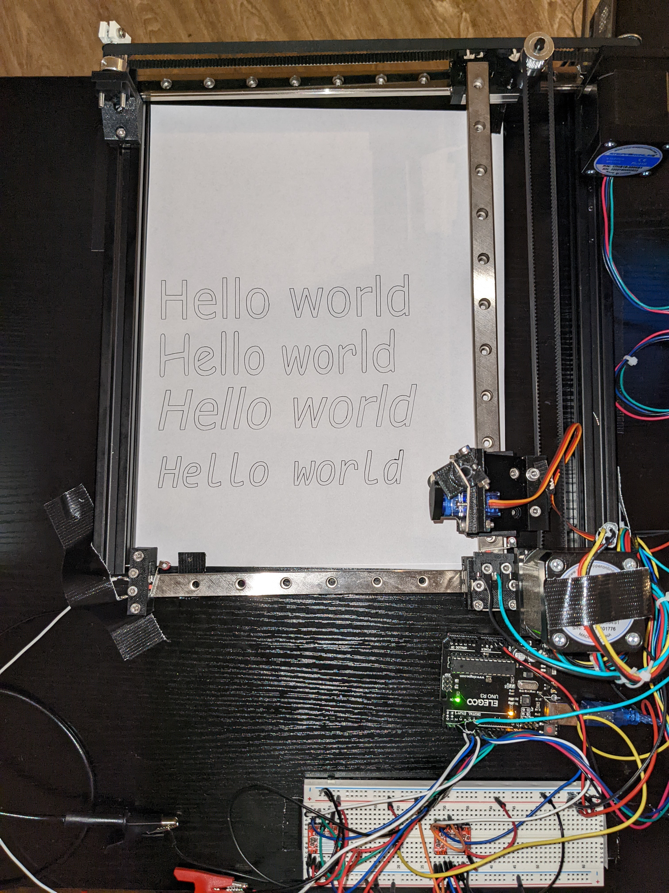
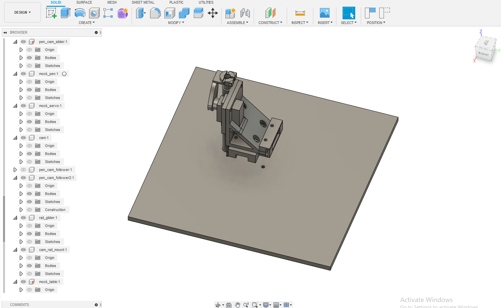

# Designing, Building, and Programming a Prototype 3 Axis CNC Pen Plotter
Hey there! I recently have been working on creating my own CNC Pen Plotter - 
essentially a machine that creates drawings by moving a pen around on
a stationary piece of paper. I wanted to write up this post to share
the project with others and document some of the challenges I faced along
the way.

See the full video of this drawing on [youtube](https://www.youtube.com/watch?v=WrL_JVUyAlU&t=5s).


## Results

|             Original Image             |             Pen Plotter              |
|:--------------------------------------:|:------------------------------------:|
|        |        |
|  |  |
|         |         |

## Overall Design
The design is fundamentally 3 linear rails on-top of 2 aluminum bars with
around 15 different 3D-printed compnents mounting stepper motors, pulleys,
timing belts, and a servo to the frame.

The 3 linear rails give smooth motion across the X and Y axes. The stepper
motors move the pen around the plane and the servo moves the pen up and down.


## Mechanical Design
All the custom parts were designed with Fusion 360 and printed on an Ender 3 Pro.
Here's a few of the highlights:


### Pen Holder
The most complex part (by far) is the pen holder, this is the part that moves the pen up and
down. A rubber-band pulls the pen down, which gives it enough pressure to write 
on the paper (otherwise it just glides along on top of the paper without leaving any
ink). A cam and follower mechanism allows the servo to raise the pen ~5mm above the
paper.





### Pen Holder Body
This is the main body of the pen holder. Although the geometry is fairly simple
this part was challenging because it needs to mount the servo and pen at just 
the right height to allow the pen to write, but still allow the pen to be
lifted off the paper.


### Pen Cam Follower
This piece mounts on top of the pen ink cartridge. A rubber-band is threaded
through the cut-out on the top to give the pen enough pressure on the page
to write.


### Pulley Mount
This piece is the core of the X axis. A timing belt attaches to the two cut-outs on
the sides which moves the pen along the X axis. It also contains the mount
for the pulley and rail of the Y axis.


### Other pieces
There are 15 different 3D printed parts on this pen plotter, so I can't
go into detail on all of them, but there are more screenshots in the
[images directory](./images).

### 3D Printing
Once designed, all the custom components were 3D printed on an Ender 3 Pro with
PLA filament. The small parts took around 30 minutes each and the larger parts
took a couple hours each.

The long printing time meant I generally tried to avoid re-designing any of the larger 
parts, even if they weren't perfect (and many weren't).


## Electronics 
There are two stepper motor drivers, two switches, and one servo connected to
an Arduino Uno.

Here's a diagram of the circuit I made (also created with Fusion 360):


And this is what that looks like wired up on a breadboard:


### Stepper Motor Drivers
The stepper motor drivers are an "A4988" chip, which makes running a stepper motor
much simpler. Pulses to the `STEP` pin cause the stepper motor to turn by some constant
angle. Setting the `DIRECTION` pin high or low changes whether the rotation is clockwise
or counterclockwise. Three more pins `MS1`, `MS2`, and `MS3` are used to configure
microstepping, which allows the motor to take extremely tiny steps.


#### Microstepping 
On the stepper motors I used in this project, Nema 17s, every step turns the shaft 1.8 degrees. Microstepping
is where the driver energizes the two phases of the stepper motor just right
to allow a smaller rotation than one full step. In my case, I have it configured
to do quarter steps. This means every pulse to the STEP pin actually turns the
motor 0.45 degrees. This gives much smoother motion and better precision for small
drawings.

## Software
With all the mechanical components and electrical wiring setup, the pen can
be moved around the XY plane and can be raised and lowered. The 
challenging part is figuring out how to put these 3 pieces together to draw
a picture.

### Auto-Homing


The first problem is that stepper motors have no feedback. All you can do is turn
the shaft in one direction or another. When the machine turns on, it has no idea
where the pen is. If it just starts drawing somewhere, it's bound to crash the pen
into the frame and potentially break the motors or the plastic parts. Therefore, we need
some reliable way to consistently put the pen into a known location before we start
drawing anything.

The solution is to mount a small switch to each axis, called a limit switch,
that the machine will bump into. When both switches are closed, we know exactly
where the pen must be. This position marks the (0,0) coordinate, and all other
coordinates are relative to this position.

When the machine turns on, the first thing it does is to start moving the pen
along each axis until it bumps into the switch. 

### Drawing Straight Lines


To draw anything, it suffices to draw straight lines. Any arbitrarily complex drawing
can be approximated with straight lines.

Drawing a line sounds pretty simple, but remember that the only control over the stepper motors
is one pin for direction, and another pin to tell it to turn one microstep. The
code that uses these two primitives to draw straight lines is the real core of
the software. 

You can see the code for yourself at `void Plotter::MoveTo(float x_mm, float y_mm)` 
in [plotter.cpp](./plotter.cpp) but the gist is that it uses a hot loop
which either steps one motor, both motors, or no motors at each iteration.

Sophisticated CNC software will also prevent jerkiness by carefully controlling
the acceleration, which I didn't end up implementing to save time, but this is
definitely something I want to explore in a version 2. Instead I have to run the
plotter relatively slowly to prevent it from knocking itself out of alignment.

### Generating G-Code

After implementing straight lines, we can in theory draw anything. But we still need some way
to convert a drawing into a series a straight lines. Thankfully, Inkscape has an excellent
plugin: [Inkscape Laser Tools](https://github.com/ChrisWag91/Inkscape-Lasertools-Plugin).
Evidently from the name, it's intended for laser engravers, but it will work just fine for
a pen. The plugin allows you to generate G-code for an image with just a few clicks.

G-Code is the programming language used by CNC machines. Here's what the start of the G-Code for
the tiger drawing shown above looks like:
```text
;Inkscape Lasertools G-code
;https://github.com/ChrisWag91/Inkscape-Lasertools-Plugin

G90	;Absolute programming
G21	;Programming in millimeters (mm)
M03 S1 ;Activate laser and set power to 0 (CUSTOM)

; START perimeter strategy
G01 F700.0
S1
G00 X31.89 Y0.09 F3000.0
S100 F3000.0
G01 X31.46 Y0.21 F700.0
G01 X30.06 Y0.6 F700.0
G01 X29.92 Y0.65 F700.0
G01 X28.04 Y1.32 F700.0
G01 X26.97 Y1.71 F700.0
G01 X26.84 Y1.75 F700.0
G01 X25.91 Y2.1 F700.0
G01 X24.85 Y2.5 F700.0
G01 X24.54 Y2.69 F700.0
G01 X24.25 Y3.14 F700.0
G01 X24.13 Y3.36 F700.0
```

1. G00 means "move to these coordinates as fast as possible"
2. G01 means "move to these coordinates in a controlled manner" (for drawing/cutting)
3. S100 means "turn the laser on" (except we don't have a laser)


At this point the most robust solution is to write a G-code interpreter for the Arduino
(or use an open-source one). I didn't want to use an open-source interpreter because I 
wanted to do almost everything from scratch to better understand CNC machines. I also
wasn't quite-yet ready to spend the time and effort it would take to write a proper 
G-code interpreter.

I decided to instead write a python script that would read the G-code and
produce a plot of the planned path and a C++ file with a huge array of
coordinates. This has a lot of limitations, but it was really quick and
easy to write, so I think it makes sense for a prototype like this. Here's what
the produced plots look like:

(The seemingly out-of-place lines are when the pen moves without writing, so they don't show
up in the final drawing)


And the generated array looks something like this:
```cpp
#include "plotter.h"
const float tiger_gcode[] PROGMEM = {
    PEN_UP,
    PEN_UP,
    31.8900,
    0.0900,
    PEN_DOWN,
    PEN_DOWN,
    31.4600,
    0.2100,
    30.0600,
    0.6000,
    29.9200,
    0.6500,
    28.0400,
    1.3200,
    26.9700,
    ...
```
This is a single array of floats which contains both coordinates and instructions about
moving the pen up and down. This can then easily be loaded and executed by the Arduino,
which was how all the drawings shown above were produced.

Packing instructions alongside coordinates like this does feel a little dangerous, but the
Arduino Uno only has 32k of flash which is only 8192 4-byte floats (and we still need
space for the rest of the program too, so we can't actually use all of that!). Given space
was such a scarcity, I wasn't willing to sacrifice space to have a better G-code
representation.

## Improvements
I had no experience with mechanical design, Fusion 360, or 3D-printing going into this project,
so there are still many components I'm not quite happy with. I wanted to produce a working
(though imperfect) version 1 rather than endlessly optimizing, so I decided to keep moving
forward as long as the pieces mostly worked. Here are a few of the major problems with this
iteration:

1. There are no bearings on the pulleys, which cause a lot of vibration and noise. The vibrations
can knock the machine out of alignment and ruin the drawing. A version 2 will definitely use 
bearings.
2. The software doesn't support constant acceleration, so the machine can jerk around on
sharp corners. Again, this knocks the whole machine out of alignment and ruins the drawing.
Likewise, version 2 should really have a better algorithm for controlling the steppers.
3. Many of the pulleys and belts are not perfectly aligned and are off by a few millimeters
in either direction. This causes more vibration and some positional error that shows up in
the drawing. I only learned how to align the components in CAD halfway through the project, so
the components I designed earlier on are not perfectly aligned.

## Conclusion
I learned a ton from this project and am reasonably happy with how the result turned out. 
It was a really magical moment seeing it draw an actual picture for the first time after
spending weeks designing and 3D-printing every component.

I'm also really glad to have spent the time learning how to use CAD software.
Being able to design and 3D print plastic parts is going to unlock
a lot of capabilities in future projects that were previously inaccessible to me.


